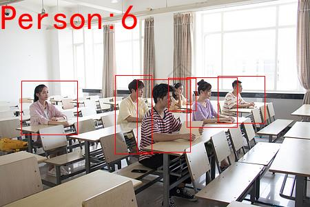
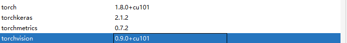

# Human_count_yolov3_Pytorch
Detect humans and display the number of them in image 检测图片中的人数并显示
*** 
predict.py是图片检测    
video.py 是检测摄像头数据并上传服务器（里面还有空调状态之类的代码，是当时参加比赛用来控制空调开关的）   
video_local.py 是调用本机摄像头或者视频流检测
权重文件用的官方的一个80类目标检测文件，我做了修改，只显示图片中检测到的人，效果图如下   
    
相应的torch和torchvision版本   

